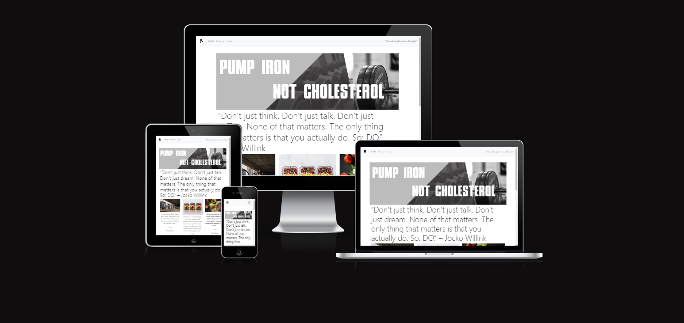
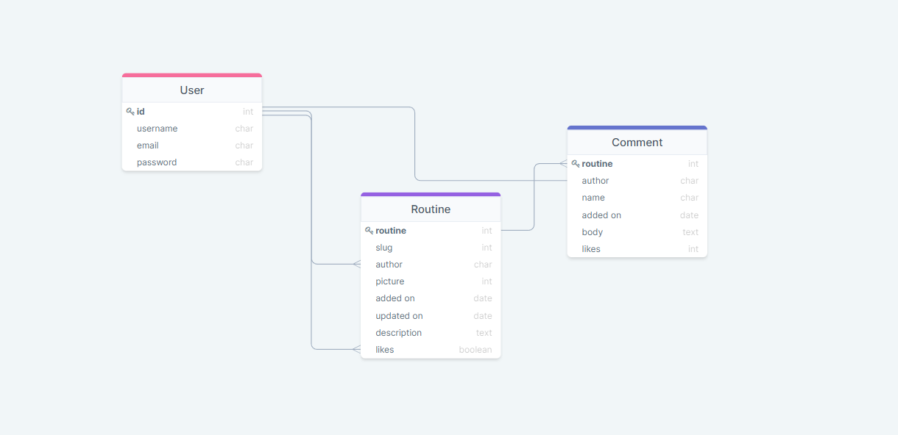
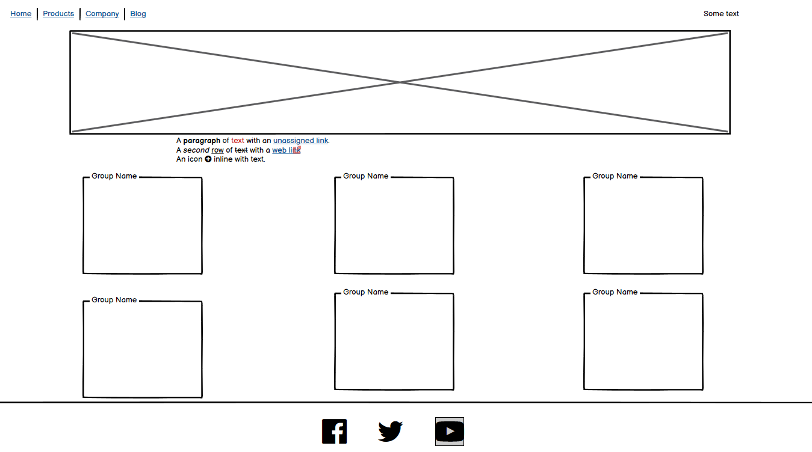
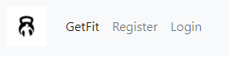
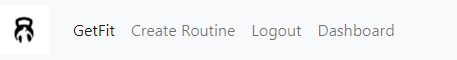

<h1 align=center>GetFit</h1> 

<h2 align=center>Introduction</h2> 

GetFit is a Personal Trainers(Gym Rat's) website/blog dedicated to sharing, creating and interacting with workout routines or daily routines like eating for fat loss, build muscle and over all staying active and healthy . Whether you are a beginner, intermediate or an advance gym "rat" looking to share your "bro science" with less experienced lifters out there, or are looking for something different to add to your workout routine or even daily eating habits, GetFit has got you covered!   Browse through the website for a bit of inspiration, tips and tricks or if you are a veteran lifter, share your thoughts and opinion with others to help get them in the best shape of their lifes!   Users have the ability to read about workout routines and eating habits registered users can create, update and delete comments on and like the admins workouts and daily routines.SuperUser is able to approve, edit and delete workouts from the website itself and also via the admin panel.  GetFit has been built using the Django framework in Python, HTML and CSS, and provides user authentication and full CRUD functionality for workout routines and also user can add goals in the users dashboard.

[Visit the live site on Heroku](https://project4django.herokuapp.com/)

 

## UX - User Experience Design

## The Strategy Plane

### Concept

This project has been developed as part of the [Code Institute's](https://codeinstitute.net/) Diploma in Full-Stack Software Development. The aim is to create a full-stack that will demonstrate the skills I have learnt in Python, Django , HTML, CSS

The main aim of the website is to provide a space for those looking to improve their physique and overall mental health.  When logged in, users will be able comment on workouts routines share their experience, like workouts and have full CRUD functionality of their own workouts.  A SuperUser will be able to approve, edit and delete user routines to allow them to manage the content of the site.

The sites target audience is:
* Fitness Enthusiasts and people looking for inspiration for workout routines, .
* People who are looking to get into fitness and have a healthy lifestyle.
* People who are looking to increase their productivty in fitness and day to day life.

### User Stories

<strong>As a General Site User:</strong>

* I can view a paginated list of workouts and fitness recipes so I can select one to try.
* I can view the comments on workouts so I can see tips and suggestions.
* I can click on a workout routine/meal to see the exercise and number of reps for different fitness goals.
* I can navigate easily around the site to find what I am looking for.

<strong>As a Registered Site User:</strong>

* I can register for an account to enable me to utilise the functionality available for registered users.
* I can create and share my own tips for workout routines in the comments section for others users to view.
* I can edit my comments and set a goal(to do) for the day
* I can comment on the  Superusers workouts to interact with the content probably have questions and tips.
* I can like workouts and share my experience  so I can interact with the content.

<strong>Agile Methodology</strong>

All functionality and development of this project were managed using GitHub Projects Kanban Board which can be found here:

[GetFit Workouts Sharing - USER STORIES](https://github.com/Sorin05/Portofolio_4_Django/projects/2)

## The Scope Plane

### Site Goals

* To motivate users to achieve their goals in fitness or any other activity 
* To provide user with a space to search for fitness routines and tips to get in better shape and stay healthy 
* To provide users with a visually pleasing website that is intuitive to use and easy to navigate
* To provide a website where the purpose is immediately clear

### Features planned

* Intuitive and simple design
* Visually appealing site 
* Intuitive navigation across all pages
* Role-based navigation for different users 
* Workouts routines   - Registered users can create, read, update and delete their Goals in the dashboard
* Users can create goals into their dashboard they can edit update and delete them 
* Comments & Likes - Registered Users can comment and like 
* User Sign Up and Log in/Out

## The Structure Plane

## Functional Scope

## The Skeleton Plane

## Wireframes 

I used Balsamiq to create low fidelity wireframes which helped me to stay on track during the development process.

Some modifications were made to the initial design during the development process based on user feedback and continuous testing.

Home Page Wireframes

 

The rest of the wireframes will be the same as the home page except the Create Routine and Dashboard which are Django Crispy Forms

 

### Imagery

For the landing page banner I used an image sourced from [Unsplash](unsplash.com) of a barbell and a slogan that I modified in photoshop.  It is grey coloured and gives the impression of a hardcore raw type of gym content. 

I also sourced an image from [Pexels](pexels.com) to use as a placeholder image if the user does not have their own image to upload when creating a workout routine.  This image was a guy lifting a barbell.

## Features

### Navigation Bar

I used the navbar from the Codestar tutorial which is the Bootstrap regular navbar without the search option

There are two role-based versions of the navigation bar depending on the user:

* Navbar 1 - General users

This navbar has a logo that shows a kettlebell and a bodybuilder gives the users the option to visit the homepage, log in or register.  There is also a quote to the left hand side of the screen .  All users have access to the Home Page and other posts posted by the Admin

* Navbar 2 - Registered users 

This navbar has a dashboard where admin(add a routine/post), register users can set edit and update a goal(to do list)
 

### Footer

The footer is borrowed again from the codestar walkthru kept simple and clean incorporating social media links to encourage users to visit other social media sites related to the main web site.
)

### Future Features/Development

* Better functionality and use of Django AllAuth.  I would like to implement more features of AllAuth in the future, including the ability to change the password or reset the password if forgotten.  I would also like to implement email verification and confirmation.
* I would like to add functionality for the registered users to post their own workout routines and meal plans/recipes.
* I would like to add a booking system where users can book a personal training session with the Admin/Superuser
* I would like to style it better with JavaScript but this being my first time building and learning about Django framework 

## Testing

Testing has taken place continuously throughout the development of the website. Each view was tested regularly using print statements to ensure the expected outcome was achieved.
All the Pep8 Testing can be found separate [TESTING](TESTING.md)

### Bugs
Theres one bug when the user try to upload a picture in the create routine page wont show but if you log in into the admin panel it works 

There are some more changes I would like to make to the styling in response to the accessibility and to improve responsivness on all devices, but due to time constraints this wasn't possible before submission of this project.

## Technologies Used
* Python
* asgiref==3.5.2
* cloudinary==1.29.0
* dj-database-url==0.5.0
* dj3-cloudinary-storage==0.0.6
* Django==3.2.14
* django-allauth==0.51.0
* django-crispy-forms==1.14.0
* django-summernote==0.8.20.0
* gunicorn==20.1.0
* oauthlib==3.2.0
* psycopg2==2.9.3
* PyJWT==2.4.0
* python3-openid==3.2.0
* pytz==2022.1
* requests-oauthlib==1.3.1
* sqlparse==0.4.2

### Libraries/Frameworks/Programs

* Django
    * Django was used as the main framework for the development of this full stack project.
    * Django AllAuth was utilised for user authentication. 

     

* Heroku PostgreSQL was used for the database
* Heroku - The project was deployed through Heroku.
* Bootstrap was used  
* Jinga/Django Templating
* Balsamiq: Balsamiq was used to create the wireframes during the design process.
* Favicon Generator: Used to create favicon used on the website.
* Font Awesome: Font Awesome was used on all pages to add icons for aesthetic and UX purposes.
* Git: Git was used for version control by utilizing the Gitpod terminal to commit to Git and Push to GitHub.
* GitHub: GitHub is used to store the project's code after being pushed from Git.
* DrawSQL.app was used to develop the database schema during development.

### Resources

* Code Institute's Codestar Django Blog was used in the beginning stages of the development of this project.  As I had never used Django before, I found the blog walkthrough to be very helpful in getting the initial app set up.   
* Django Documentation - I relied heavily on the Django official documentation during the build of this project.
* W3C Schools documentation for CSS
* Google
* Stack overflow
* Code Institute's Slack Community.

## Deployment

### Deployment through Heroku

1. Sign up / Log in to Heroku

2. From the main Heroku Dashboard page select 'New' and then 'Create New App'

3. Give the project a name and select a suitable region, then select create app. The name for the app must be unique. This will create the app within Heroku and bring you to the deploy tab. From the submenu at the top, navigate to the resources tab.

4. Add the database to the app, in the add-ons section search for 'Heroku Postgres', select the package that appears and add 'Heroku Postgres' as the database

5. Navigate to the setting tab, within the config vars section copy the DATABASE_URL to the clipboard for use in the Django configuration.

6. Within the django app repository create a new file called env.py - within this file import the os library and set the environment variable for the DATABASE_URL pasting in the address copied from Heroku. The line should appear as os.environ["DATABASE_URL"]= "Paste the link in here"

7. Add a secret key to the app using os.environ["SECRET_KEY"] = "your secret key goes here"
Add the secret key just created to the Heroku Config Vars as SECRET_KEY for the KEY value and the secret key value you created as the VALUE

8. In the settings.py file within the django app, import Path from pathlib, import os and import dj_database_url
insert the line if os.path.isfile("env.py"): import env
remove the insecure secret key that django has in the settings file by default and replace it with SECRET_KEY = os.environ.get('SECRET_KEY')
replace the databases section with DATABASES = { 'default': dj_database_url.parse(os.environ.get("DATABASE_URL"))} ensure the correct indentation for python is used.

9. In the terminal migrate the models over to the new database connection
Navigate in a browser to cloudinary, log in, or create an account and log in.

10. From the dashboard - copy the CLOUDINARY_URL to the clipboard
in the env.py file created earlier - add os.environ["CLOUDINARY_URL"] = "paste in the Url copied to the clipboard here"

11. In Heroku, add the CLOUDINARY_URL and value copied to the clipboard to the config vars
Also add the KEY - DISABLE_COLLECTSTATIC with the Value - 1 to the config vars
this key value pair must be removed prior to final deployment

12. Add the cloudinary libraries to the list of installed apps, the order they are inserted is important, 'cloudinary_storage' goes above 'django.contrib.staticfiles' and 'cloudinary' goes below it.

13. In the Settings.py file - add the STATIC files settings - the url, storage path, directory path, root path, media url and default file storage path.
Link the file to the templates directory in Heroku TEMPLATES_DIR = os.path.join(BASE_DIR, 'templates')

14. Change the templates directory to TEMPLATES_DIR - 'DIRS': [TEMPLATES_DIR]

15. Add Heroku to the ALLOWED_HOSTS list the format will be the app name given in Heroku when creating the app followed by .herokuapp.com

16. In your code editor, create three new top level folders, media, static, templates

17. Create a new file on the top level directory - Procfile

18. Within the Procfile add the code - web: guincorn PROJECT_NAME.wsgi

19. In the terminal, add the changed files, commit and push to GitHub

20. In Heroku, navigate to the deployment tab and deploy the branch manually - watch the build logs for any errors.

Heroku will now build the app for you. Once it has completed the build process you will see a 'Your App Was Successfully Deployed' message and a link to the app to visit the live site.

### Forking the Gihub Repository

1. By forking the GitHub Repository, you will be able to make a copy of the original repository on your own GitHub account, allowing you to view and/or make changes without affecting the original repository by using the following steps:

2. Log in to GitHub and locate the GitHub Repository At the top of the Repository (not top of page), just above the "Settings" button on the menu, locate the "Fork" button. You should now have a copy of the original repository in your GitHub account.

### Making a Local Clone

1. Log in to GitHub and locate the GitHub Repository Under the repository name.

2. Click "Clone or download". 

3. To clone the repository using HTTPS, under "Clone with HTTPS", copy the link. 

4. Open Git Bash.  

5. Change the current working directory to the location where you want the cloned directory to be made. 

6. Type git clone, and then paste the URL you copied in Step 3.

## Credits

* As this was my first Django project, I took a lot of inspiration from th [Code Institute's](https://codeinstitute.net/) Django Blog walkthrough.  I took inspiration from the models, views and templates to get the skeleton of the project up and running and as I became more familiar with Django I started to customise this to make it my own. 

* The main image and the placeholder image were sourced from [Pixabay](https://pixabay.com/) and [Unsplash](https://unsplash.com/) respectively. 

### Huge Thank You
A massive thank you to Daniel_C the channel lead for helping me out through all this time [https://github.com/xiaoniuniu89]
Thank you to all my felow students on slack 